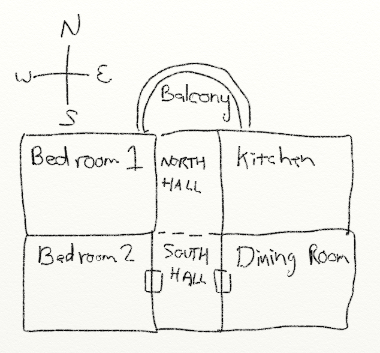
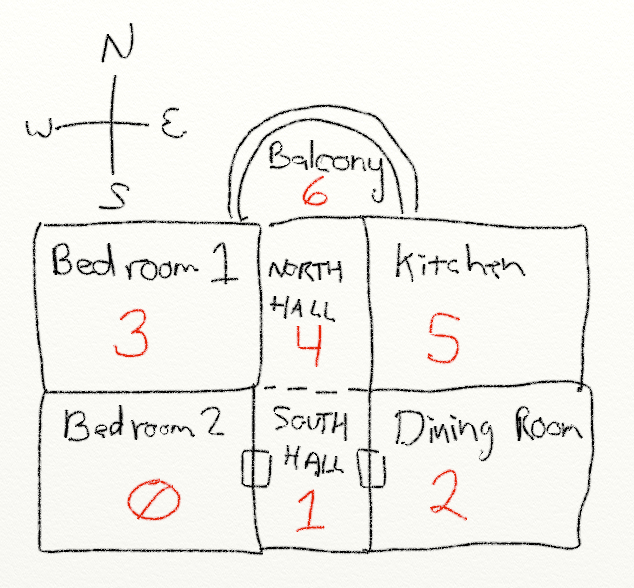

Before you start, sketch out the dungeon that you want to create. It might look something like this: 

[]

Next, number all of the rooms starting at zero:

[]

1. Create an empty array called room_list.
2. Create a variable called room. Set it equal to an array with five elements. For the first element, create a string with a description of your first room. The last four elements will be the number of the next room if the user goes north, east, south, or west. Look at your sketch to see what numbers to use. Use None if no room hooks up in that direction. (Do not put None in quotes. Also, remember that Python is case sensitive so none won't work either. The keyword None is a special value that represents “nothing.” Because sometimes you need a value, other than zero, that represents )
3. Append this room to the room list.
4. Repeat the prior two steps for each room you want to create. Just re-use the room variable.
5. Create a variable called current_room. Set it to zero.
6. Print the room_list variable. Run the program. You should see a really long list of every room in your adventure.
7. Adjust your print statement to only print the first room (element zero) in the list. Run the program and confirm you get output similar to:
   ['You are in a room. There is a passage to the north.', 1, None, None, None]
8. Using current_room and room_list, print the current room the user is in. Since your first room is zero, the output should be the same as before.
9. Change the print statement so that you only print the description of the room, and not the rooms that hook up to it. Remember if you are printing a list in a list the index goes after the first index. Don't do this: [current_room[0]], do [current_room][0]
   You are in a room. There is a passage to the north.
10. Create a variable called done and set it to False. Then put the printing of the room description in a while loop that repeats until done is set to True.
11. Before printing the description, add a code to print a blank line. This will make it visually separate each turn when playing the game.
12. After printing the room description, add a line of code that asks the user what they want to do.
13. Add an if statement to see if the user wants to go north.
14. If the user wants to go north, create a variable called next_room and get it equal to room_list[current_room][1], which should be the number for what room is to the north.
15. Add another if statement to see if the next room is equal to None. If it is, print “You can't go that way.” Otherwise set current_room equal to next_room.
16. Test your program. Can you go north to a new room?
17. Add elif statements to handle east, south, and west. Add an else statement to let the user know the program doesn't understand what they typed.
18. It is a great idea to put blank lines between the code that handles each direction. I don't mean to print a blank line, but actually have blank lines in the code. That way you visually group the code into sections.
19. It is a great idea to add comments too, to each section.
20. Test your program. Make sure you have enough of a description that someone running the program will no what direction to go. Don't say "You are in the kitchen." Instead say "You are in the kitchen. There is a door to the north."
21. Optional: Add a quit command. Make sure that the program works for upper and lower case directions. Have the program work if the user types in “north” or “n”. 
